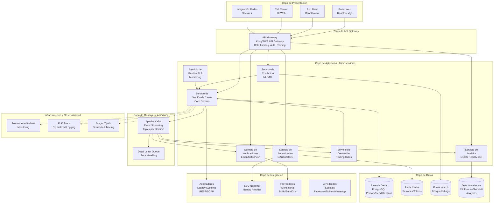
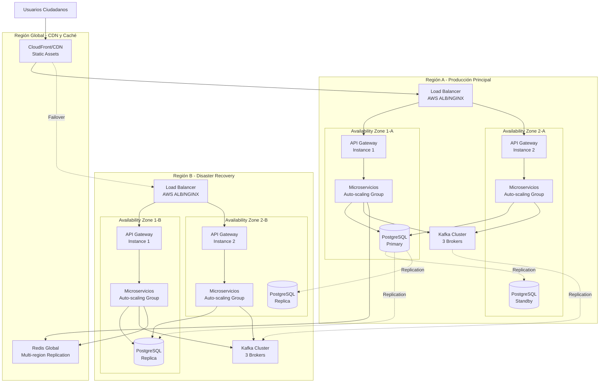
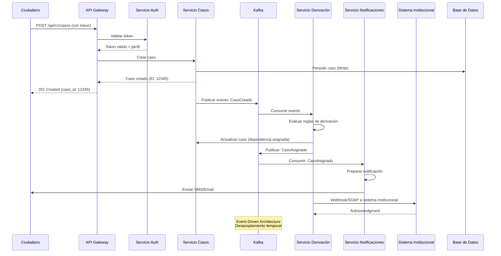
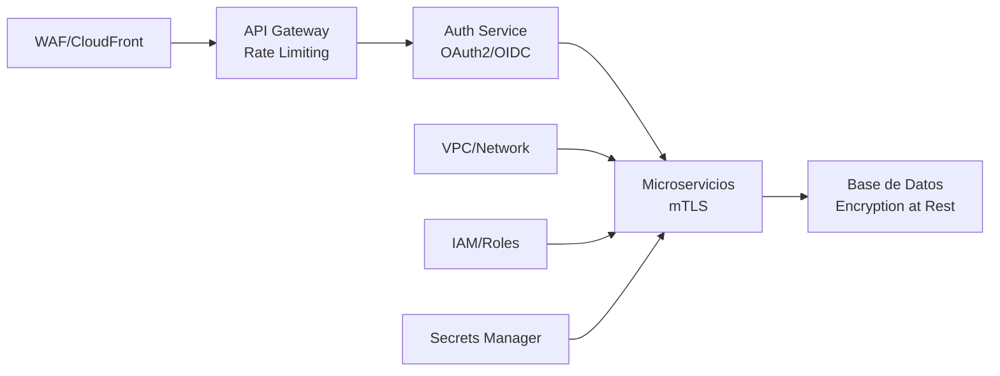

# 1. Diagrama de Arquitectura Detallado - Conecta360

## Visión General

La arquitectura de Conecta360 está diseñada siguiendo los principios de **microservicios**, **event-driven architecture** y **arquitectura en capas**, asegurando escalabilidad, resiliencia y mantenibilidad.

## Diagrama de Arquitectura - Vista de Niveles (C4 Model Level 1)

## Diagrama de Arquitectura - Vista de Despliegue (Multi-Región)

## Flujo de Procesamiento de un Caso

## Capas del Sistema

### 1. Capa de Presentación
- **Portal Web**: React/Next.js con SSR para SEO
- **App Móvil**: React Native (iOS/Android)
- **Call Center UI**: Aplicación web interna para operadores
- **Widget Embebible**: Para integración en sitios de dependencias

### 2. Capa de API Gateway
- **Función**: Punto único de entrada, enrutamiento, autenticación, rate limiting
- **Tecnología**: Kong, AWS API Gateway o NGINX Plus
- **Características**:
  - Rate limiting por IP/usuario
  - Autenticación OAuth2/OIDC
  - Transformación de requests/responses
  - Circuit breaker patterns
  - Request/Response logging

### 3. Capa de Aplicación (Microservicios)

#### 3.1 Servicio de Autenticación y Autorización
- **Responsabilidad**: Gestión de identidades, SSO, tokens JWT
- **Stack**: Node.js/Python con OAuth2 server

#### 3.2 Servicio de Gestión de Casos (Core Domain)
- **Responsabilidad**: CRUD de casos, workflow, estados
- **Stack**: Java/Spring Boot o .NET Core
- **Patrón**: Domain-Driven Design (DDD)

#### 3.3 Servicio de Notificaciones
- **Responsabilidad**: Email, SMS, push notifications
- **Stack**: Node.js con workers asíncronos

#### 3.4 Servicio de Chatbot IA
- **Responsabilidad**: Clasificación inicial, routing inteligente
- **Stack**: Python con NLP (BERT/GPT-based models)

#### 3.5 Servicio de Derivación
- **Responsabilidad**: Reglas de negocio para asignar casos
- **Stack**: Java/.NET con rule engine (Drools/Ortools)

#### 3.6 Servicio de Gestión SLA
- **Responsabilidad**: Monitoreo de tiempos, alertas
- **Stack**: Go/Rust para alta concurrencia

#### 3.7 Servicio de Analítica (CQRS Read Model)
- **Responsabilidad**: Dashboards, reportes, KPIs
- **Stack**: Node.js con consultas optimizadas

### 4. Capa de Integración
- **Adaptadores Legacy**: REST/SOAP/gRPC adapters para sistemas antiguos
- **SSO Nacional**: Integración con identity provider gubernamental
- **Proveedores Mensajería**: Twilio, SendGrid, FCM
- **APIs Redes Sociales**: Facebook Graph API, Twitter API, WhatsApp Business API

### 5. Capa de Mensajería Asíncrona
- **Apache Kafka**: Event streaming para comunicación desacoplada
- **Topics principales**:
  - `casos.creados`
  - `casos.asignados`
  - `casos.actualizados`
  - `casos.cerrados`
  - `notificaciones.enviadas`
  - `sla.violados`

### 6. Capa de Datos
- **PostgreSQL**: Base de datos principal (ACID compliance)
  - Primary-Replica setup multi-región
  - Particionamiento por dependencia y fecha
- **Redis**: Cache distribuido (sesiones, tokens, datos frecuentes)
- **Elasticsearch**: Búsqueda full-text, logs centralizados
- **ClickHouse/Redshift**: Data warehouse para analítica

### 7. Infraestructura y Observabilidad
- **Monitoring**: Prometheus + Grafana (métricas)
- **Logging**: ELK Stack (Elasticsearch, Logstash, Kibana)
- **Tracing**: Jaeger/Zipkin (distributed tracing)
- **Alerting**: PagerDuty/OpsGenie

## Seguridad y Compliance

### Seguridad en Capas

### Consideraciones de Seguridad
1. **Encriptación en tránsito**: TLS 1.3 en todas las comunicaciones
2. **Encriptación en reposo**: AES-256 para bases de datos
3. **Segregación de datos**: Aislamiento lógico por dependencia (multitenancy)
4. **Auditoría**: Log completo de todas las operaciones (quién, qué, cuándo)
5. **Control de acceso**: RBAC con roles granulares (ciudadano, operador, supervisor, admin)
6. **Compliance**: GDPR-like, protección de datos personales

## Escalabilidad

### Estrategia de Escalado
- **Horizontal**: Auto-scaling basado en CPU/memoria/request rate
- **Vertical**: Instancias optimizadas por carga de trabajo
- **Cache**: Redis para reducir carga en base de datos
- **CDN**: CloudFront para assets estáticos
- **Read Replicas**: Distribución de lecturas en múltiples réplicas

### Capacidad Estimada
- **500,000 solicitudes/día** = ~5,787 req/s (peak)
- **Pico estimado**: 20,000 req/s (día de alta demanda)
- **Replicas necesarias**: ~40-50 instancias de microservicios (con balanceo)

## Resiliencia y Alta Disponibilidad

### Patrones Aplicados
1. **Circuit Breaker**: Evita cascading failures
2. **Retry con exponential backoff**: Para operaciones transitorias
3. **Bulkhead**: Aislamiento de recursos críticos
4. **Health Checks**: Endpoints `/health` y `/ready`
5. **Graceful Shutdown**: Cierre ordenado sin pérdida de datos
6. **Database Connection Pooling**: Optimización de conexiones

### Disaster Recovery
- **RTO (Recovery Time Objective)**: < 1 hora
- **RPO (Recovery Point Objective)**: < 15 minutos
- **Backup Strategy**: Diarios incrementales + backups completos semanales
- **Failover automático**: Route 53 health checks con DNS failover

## Consideraciones de Rendimiento

### Optimizaciones
1. **CQRS**: Separación de modelos de lectura/escritura
2. **Database Indexing**: Índices estratégicos en campos frecuentes
3. **Pagination**: Todos los endpoints de listado con paginación
4. **Compression**: Gzip/Brotli para responses grandes
5. **Async Processing**: Operaciones pesadas en background workers
6. **Connection Pooling**: Gestión eficiente de conexiones DB

### SLA de Rendimiento
- **P95 Response Time**: < 1.5s (requerimiento cumplido)
- **P99 Response Time**: < 3s
- **Availability**: 99.9% (≈ 8.76 horas de downtime/año)

---

**Siguiente**: Ver [Base de Datos](./02-base-datos.md)

