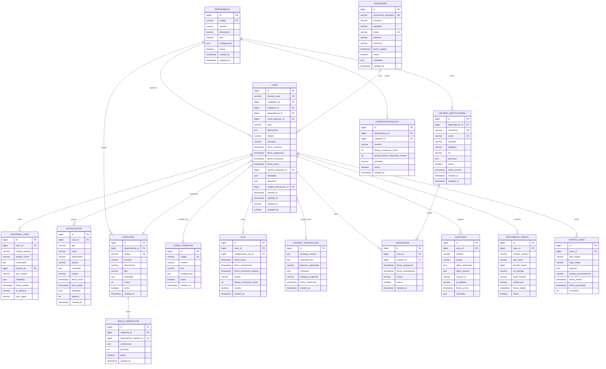

# 2. Modelo de Base de Datos - Conecta360

## Visión General

El modelo de datos está diseñado para soportar **multitenancy** (múltiples instituciones), **auditoría completa**, **escalabilidad horizontal** y **alto rendimiento de consultas**.

## Diagrama Entidad-Relación (Modelo Conceptual)



## Esquema Relacional Detallado

### Tablas Principales

#### 1. `ciudadanos`
Almacena información de ciudadanos registrados en el sistema.

```sql
CREATE TABLE ciudadanos (
    id BIGSERIAL PRIMARY KEY,
    documento_identidad VARCHAR(50) UNIQUE NOT NULL,
    nombres VARCHAR(200) NOT NULL,
    apellidos VARCHAR(200) NOT NULL,
    email VARCHAR(255) UNIQUE NOT NULL,
    telefono VARCHAR(20),
    direccion TEXT,
    fecha_registro TIMESTAMP DEFAULT CURRENT_TIMESTAMP,
    activo BOOLEAN DEFAULT TRUE,
    metadata JSONB, -- Datos adicionales flexibles
    updated_at TIMESTAMP DEFAULT CURRENT_TIMESTAMP,
    
    INDEX idx_ciudadanos_documento (documento_identidad),
    INDEX idx_ciudadanos_email (email),
    INDEX idx_ciudadanos_activo (activo)
);

-- Particionamiento por fecha_registro para escalabilidad
CREATE TABLE ciudadanos_2024 PARTITION OF ciudadanos 
FOR VALUES FROM ('2024-01-01') TO ('2025-01-01');
```

#### 2. `casos` (Core Table)
Tabla central que almacena todos los casos ciudadanos.

```sql
CREATE TABLE casos (
    id BIGSERIAL PRIMARY KEY,
    numero_caso VARCHAR(50) UNIQUE NOT NULL, -- Formato: CRV-2024-00012345
    ciudadano_id BIGINT NOT NULL REFERENCES ciudadanos(id),
    categoria_id BIGINT NOT NULL REFERENCES categorias(id),
    dependencia_id BIGINT NOT NULL REFERENCES dependencias(id),
    canal_atencion_id BIGINT NOT NULL REFERENCES canales_atencion(id),
    titulo VARCHAR(500) NOT NULL,
    descripcion TEXT NOT NULL,
    estado VARCHAR(50) NOT NULL, -- PENDIENTE, ASIGNADO, EN_PROCESO, RESUELTO, CERRADO, CANCELADO
    prioridad VARCHAR(20) NOT NULL, -- BAJA, MEDIA, ALTA, URGENTE
    fecha_creacion TIMESTAMP DEFAULT CURRENT_TIMESTAMP,
    fecha_asignacion TIMESTAMP,
    fecha_resolucion TIMESTAMP,
    fecha_cierre TIMESTAMP,
    usuario_asignado_id BIGINT REFERENCES usuarios_institucionales(id),
    metadata JSONB, -- Campos flexibles por dependencia
    ubicacion JSONB, -- {lat, lng, direccion, barrio}
    chatbot_interaccion_id BIGINT REFERENCES chatbot_interacciones(id),
    created_at TIMESTAMP DEFAULT CURRENT_TIMESTAMP,
    updated_at TIMESTAMP DEFAULT CURRENT_TIMESTAMP,
    created_by VARCHAR(100),
    updated_by VARCHAR(100),
    
    CONSTRAINT fk_caso_ciudadano FOREIGN KEY (ciudadano_id) REFERENCES ciudadanos(id),
    CONSTRAINT fk_caso_categoria FOREIGN KEY (categoria_id) REFERENCES categorias(id),
    CONSTRAINT fk_caso_dependencia FOREIGN KEY (dependencia_id) REFERENCES dependencias(id),
    CONSTRAINT fk_caso_canal FOREIGN KEY (canal_atencion_id) REFERENCES canales_atencion(id),
    
    INDEX idx_casos_numero (numero_caso),
    INDEX idx_casos_ciudadano (ciudadano_id),
    INDEX idx_casos_estado (estado),
    INDEX idx_casos_dependencia (dependencia_id),
    INDEX idx_casos_fecha_creacion (fecha_creacion),
    INDEX idx_casos_asignado (usuario_asignado_id),
    INDEX idx_casos_estado_fecha (estado, fecha_creacion),
    INDEX idx_casos_metadata_gin (metadata) USING GIN, -- Búsqueda en JSONB
    INDEX idx_casos_ubicacion_gin (ubicacion) USING GIN
) PARTITION BY RANGE (fecha_creacion);

-- Particionamiento mensual para optimizar consultas y mantenimiento
CREATE TABLE casos_2024_01 PARTITION OF casos 
FOR VALUES FROM ('2024-01-01') TO ('2024-02-01');
CREATE TABLE casos_2024_02 PARTITION OF casos 
FOR VALUES FROM ('2024-02-01') TO ('2024-03-01');
-- ... (más particiones según necesidad)
```

#### 3. `dependencias`
Instituciones gubernamentales que gestionan casos.

```sql
CREATE TABLE dependencias (
    id BIGSERIAL PRIMARY KEY,
    codigo VARCHAR(50) UNIQUE NOT NULL, -- Ej: MIN-SALUD, MUN-ALCALDIA
    nombre VARCHAR(200) NOT NULL,
    descripcion TEXT,
    tipo VARCHAR(50), -- MINISTERIO, MUNICIPALIDAD, ORGANISMO_AUTONOMO
    configuracion JSONB, -- Configuración específica por dependencia
    activa BOOLEAN DEFAULT TRUE,
    created_at TIMESTAMP DEFAULT CURRENT_TIMESTAMP,
    updated_at TIMESTAMP DEFAULT CURRENT_TIMESTAMP,
    
    INDEX idx_dependencias_codigo (codigo),
    INDEX idx_dependencias_activa (activa)
);
```

#### 4. `categorias`
Categorización de casos por tipo de solicitud.

```sql
CREATE TABLE categorias (
    id BIGSERIAL PRIMARY KEY,
    dependencia_id BIGINT NOT NULL REFERENCES dependencias(id),
    codigo VARCHAR(50) NOT NULL,
    nombre VARCHAR(200) NOT NULL,
    descripcion TEXT,
    tipo VARCHAR(50), -- INCIDENCIA, SOLICITUD, QUEJA, RECLAMO
    metadata JSONB,
    orden INT DEFAULT 0,
    activa BOOLEAN DEFAULT TRUE,
    created_at TIMESTAMP DEFAULT CURRENT_TIMESTAMP,
    
    CONSTRAINT uk_categoria_dependencia_codigo UNIQUE (dependencia_id, codigo),
    
    INDEX idx_categorias_dependencia (dependencia_id),
    INDEX idx_categorias_activa (activa)
);
```

#### 5. `historial_casos`
Registro completo de cambios de estado y acciones sobre casos.

```sql
CREATE TABLE historial_casos (
    id BIGSERIAL PRIMARY KEY,
    caso_id BIGINT NOT NULL REFERENCES casos(id),
    estado_anterior VARCHAR(50),
    estado_nuevo VARCHAR(50),
    comentario TEXT,
    usuario_id BIGINT REFERENCES usuarios_institucionales(id),
    tipo_cambio VARCHAR(50), -- CAMBIO_ESTADO, ASIGNACION, REASIGNACION, COMENTARIO
    metadata JSONB,
    fecha_cambio TIMESTAMP DEFAULT CURRENT_TIMESTAMP,
    ip_address VARCHAR(45),
    user_agent VARCHAR(500),
    
    INDEX idx_historial_caso (caso_id),
    INDEX idx_historial_fecha (fecha_cambio),
    INDEX idx_historial_usuario (usuario_id)
) PARTITION BY RANGE (fecha_cambio);
```

#### 6. `notificaciones`
Registro de todas las notificaciones enviadas a ciudadanos.

```sql
CREATE TABLE notificaciones (
    id BIGSERIAL PRIMARY KEY,
    caso_id BIGINT NOT NULL REFERENCES casos(id),
    tipo VARCHAR(50) NOT NULL, -- CREACION, ASIGNACION, ACTUALIZACION, CIERRE
    canal VARCHAR(20) NOT NULL, -- EMAIL, SMS, PUSH, WHATSAPP
    destinatario VARCHAR(255) NOT NULL,
    asunto VARCHAR(500),
    contenido TEXT NOT NULL,
    estado VARCHAR(50) DEFAULT 'PENDIENTE', -- PENDIENTE, ENVIADO, FALLIDO, LEIDO
    fecha_envio TIMESTAMP,
    fecha_leido TIMESTAMP,
    metadata JSONB,
    intentos INT DEFAULT 0,
    created_at TIMESTAMP DEFAULT CURRENT_TIMESTAMP,
    
    INDEX idx_notificaciones_caso (caso_id),
    INDEX idx_notificaciones_estado (estado),
    INDEX idx_notificaciones_fecha (fecha_envio),
    INDEX idx_notificaciones_destinatario (destinatario)
) PARTITION BY RANGE (fecha_envio);
```

#### 7. `usuarios_institucionales`
Funcionarios y operadores que gestionan casos.

```sql
CREATE TABLE usuarios_institucionales (
    id BIGSERIAL PRIMARY KEY,
    dependencia_id BIGINT NOT NULL REFERENCES dependencias(id),
    username VARCHAR(100) UNIQUE NOT NULL,
    email VARCHAR(255) UNIQUE NOT NULL,
    nombres VARCHAR(200) NOT NULL,
    apellidos VARCHAR(200) NOT NULL,
    rol VARCHAR(50) NOT NULL, -- OPERADOR, SUPERVISOR, ADMINISTRADOR
    permisos JSONB, -- Permisos granulares por funcionalidad
    activo BOOLEAN DEFAULT TRUE,
    ultimo_acceso TIMESTAMP,
    created_at TIMESTAMP DEFAULT CURRENT_TIMESTAMP,
    updated_at TIMESTAMP DEFAULT CURRENT_TIMESTAMP,
    
    INDEX idx_usuarios_username (username),
    INDEX idx_usuarios_email (email),
    INDEX idx_usuarios_dependencia (dependencia_id),
    INDEX idx_usuarios_activo (activo),
    INDEX idx_usuarios_rol (rol)
);
```

#### 8. `slas`
Seguimiento de Service Level Agreements por caso.

```sql
CREATE TABLE slas (
    id BIGSERIAL PRIMARY KEY,
    caso_id BIGINT NOT NULL REFERENCES casos(id),
    configuracion_sla_id BIGINT REFERENCES configuraciones_sla(id),
    fecha_inicio TIMESTAMP NOT NULL,
    fecha_vencimiento TIMESTAMP NOT NULL,
    fecha_resolucion_objetivo TIMESTAMP NOT NULL,
    estado VARCHAR(50) DEFAULT 'VIGENTE', -- VIGENTE, CUMPLIDO, VIOLADO
    tiempo_resolucion_horas INT NOT NULL,
    violado BOOLEAN DEFAULT FALSE,
    created_at TIMESTAMP DEFAULT CURRENT_TIMESTAMP,
    
    INDEX idx_slas_caso (caso_id),
    INDEX idx_slas_vencimiento (fecha_vencimiento),
    INDEX idx_slas_violado (violado),
    INDEX idx_slas_estado (estado)
);
```

### Tablas de Integración y Eventos

#### 9. `eventos_casos`
Registro de eventos para publicación en Kafka (event sourcing pattern).

```sql
CREATE TABLE eventos_casos (
    id BIGSERIAL PRIMARY KEY,
    caso_id BIGINT NOT NULL REFERENCES casos(id),
    tipo_evento VARCHAR(100) NOT NULL, -- caso.creado, caso.asignado, caso.actualizado
    topic_kafka VARCHAR(100) NOT NULL,
    payload JSONB NOT NULL,
    estado_procesamiento VARCHAR(50) DEFAULT 'PENDIENTE', -- PENDIENTE, PROCESADO, ERROR
    fecha_evento TIMESTAMP DEFAULT CURRENT_TIMESTAMP,
    fecha_procesado TIMESTAMP,
    reintentos INT DEFAULT 0,
    
    INDEX idx_eventos_caso (caso_id),
    INDEX idx_eventos_procesamiento (estado_procesamiento),
    INDEX idx_eventos_fecha (fecha_evento)
) PARTITION BY RANGE (fecha_evento);
```

#### 10. `auditoria`
Tabla de auditoría completa para compliance y trazabilidad.

```sql
CREATE TABLE auditoria (
    id BIGSERIAL PRIMARY KEY,
    caso_id BIGINT REFERENCES casos(id),
    entidad VARCHAR(100) NOT NULL,
    accion VARCHAR(50) NOT NULL, -- CREATE, UPDATE, DELETE, ASSIGN, CLOSE
    datos_anteriores JSONB,
    datos_nuevos JSONB,
    usuario_id VARCHAR(100),
    ip_address VARCHAR(45),
    fecha_accion TIMESTAMP DEFAULT CURRENT_TIMESTAMP,
    metadata JSONB,
    
    INDEX idx_auditoria_caso (caso_id),
    INDEX idx_auditoria_entidad (entidad),
    INDEX idx_auditoria_fecha (fecha_accion),
    INDEX idx_auditoria_usuario (usuario_id)
) PARTITION BY RANGE (fecha_accion);
```

## Modelo de Datos - Consideraciones de Diseño

### 1. Multitenancy
- **Aislamiento lógico**: Columna `dependencia_id` en todas las tablas relevantes
- **Filtrado automático**: Views o row-level security (RLS) en PostgreSQL
- **Método**: Soft multitenancy (más simple, suficiente para este caso)

### 2. Particionamiento
- **Razón**: Escalabilidad y mantenimiento
- **Estrategia**: Particionamiento por rango de fecha en tablas de alto volumen
  - `casos`: Por mes
  - `historial_casos`: Por mes
  - `notificaciones`: Por mes
  - `eventos_casos`: Por mes
  - `auditoria`: Por mes

### 3. Índices Estratégicos
- **Índices B-tree**: Para consultas de igualdad y rangos
- **Índices GIN**: Para búsquedas en campos JSONB
- **Índices compuestos**: Para consultas frecuentes multi-columna

### 4. JSONB para Flexibilidad
- Uso de `JSONB` en campos `metadata` para:
  - Adaptarse a necesidades específicas por dependencia
  - Evolución del esquema sin migraciones costosas
  - Almacenamiento eficiente y búsqueda indexada

### 5. Normalización vs Desnormalización
- **Normalizado**: Relaciones principales (evita redundancia)
- **Desnormalizado**: Campos calculados en `casos` para consultas rápidas
  - Ejemplo: `usuario_asignado_id` redundante pero útil para performance

### 6. Naming Conventions
- **Formato**: `snake_case` para tablas y columnas
- **Primary Keys**: Siempre `id` (BIGSERIAL)
- **Foreign Keys**: Formato `{tabla}_id`
- **Timestamps**: `created_at`, `updated_at`, `deleted_at` (soft delete)

## Estrategia de Migración y Versionado

### Versionado de Esquema
- Herramienta: **Flyway** o **Liquibase**
- Migraciones incrementales versionadas
- Rollback strategy documentado

### Ejemplo de Migración
```sql
-- V1__create_initial_schema.sql
-- V2__add_indexes.sql
-- V3__partition_casos_table.sql
-- ...
```

## Consideraciones de Performance

### Query Optimization
1. **Read Replicas**: Todas las consultas de lectura a réplicas
2. **Connection Pooling**: PgBouncer o similar
3. **Materialized Views**: Para reportes complejos (refresh programado)
4. **Caching Layer**: Redis para queries frecuentes

### Ejemplo de Query Optimizada
```sql
-- Consulta de casos con joins optimizados
SELECT 
    c.id,
    c.numero_caso,
    c.titulo,
    c.estado,
    ciu.nombres || ' ' || ciu.apellidos AS ciudadano,
    dep.nombre AS dependencia,
    cat.nombre AS categoria
FROM casos c
INNER JOIN ciudadanos ciu ON c.ciudadano_id = ciu.id
INNER JOIN dependencias dep ON c.dependencia_id = dep.id
INNER JOIN categorias cat ON c.categoria_id = cat.id
WHERE c.dependencia_id = $1
  AND c.estado = $2
  AND c.fecha_creacion >= $3
ORDER BY c.fecha_creacion DESC
LIMIT $4 OFFSET $5;
```

## Seguridad de Datos

### Encriptación
- **At Rest**: AES-256 (PostgreSQL TDE o disk-level encryption)
- **In Transit**: TLS 1.3
- **Backups**: Encriptados con claves separadas

### Row-Level Security (RLS)
```sql
-- Ejemplo de política RLS para multitenancy
CREATE POLICY dependencia_isolation ON casos
    FOR ALL
    TO aplicacion_role
    USING (dependencia_id = current_setting('app.current_dependencia_id')::BIGINT);
```

---

**Siguiente**: Ver [Decisiones Tecnológicas](./03-decisiones-tecnologicas.md)


