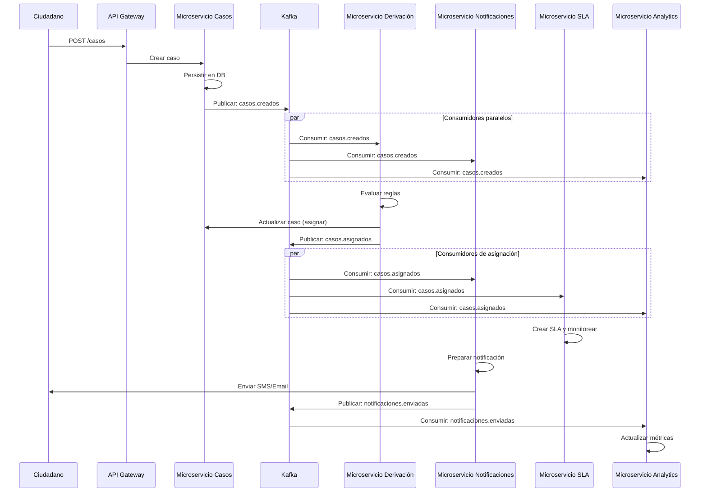

# 5. Diseño de APIs Asíncronas - Conecta360

## Visión General

Este documento define la arquitectura de mensajería asíncrona de Conecta360 usando Apache Kafka, siguiendo el estándar AsyncAPI para describir eventos y canales de comunicación.

## Especificación AsyncAPI

### AsyncAPI 2.6.0 Specification

```yaml
asyncapi: 2.6.0
info:
  title: Conecta360 Event Streaming API
  version: 1.0.0
  description: |
    Sistema Integral de Atención Ciudadana - Conecta360
    
    API de Eventos Asíncronos usando Apache Kafka para comunicación entre microservicios.
    
    **Protocolo:** Apache Kafka
    **Formato de mensaje:** JSON
    **Versionado:** Por topic (ej: casos.creados.v1, casos.creados.v2)
  contact:
    name: API Support
    email: api-support@conecta360.gov.cv
  license:
    name: Propietario - Gobierno de Costa Verde

servers:
  kafka-prod:
    url: kafka.conecta360.gov.cv:9092
    protocol: kafka
    description: Servidor Kafka de producción
  kafka-staging:
    url: kafka-staging.conecta360.gov.cv:9092
    protocol: kafka
    description: Servidor Kafka de staging

defaultContentType: application/json

channels:
  casos.creados:
    description: |
      Evento publicado cuando se crea un nuevo caso ciudadano.
      Consumidores: Servicio de Derivación, Servicio de Notificaciones, Servicio de Analítica
    publish:
      operationId: publicarCasoCreado
      summary: Publicar evento de caso creado
      message:
        $ref: '#/components/messages/CasoCreado'
    subscribe:
      operationId: consumirCasoCreado
      summary: Consumir evento de caso creado
      message:
        $ref: '#/components/messages/CasoCreado'
    
  casos.asignados:
    description: |
      Evento publicado cuando un caso es asignado a una dependencia o usuario.
      Consumidores: Servicio de Notificaciones, Servicio de SLA, Servicio de Analítica
    publish:
      operationId: publicarCasoAsignado
      summary: Publicar evento de caso asignado
      message:
        $ref: '#/components/messages/CasoAsignado'
    subscribe:
      operationId: consumirCasoAsignado
      summary: Consumir evento de caso asignado
      message:
        $ref: '#/components/messages/CasoAsignado'
    
  casos.actualizados:
    description: |
      Evento publicado cuando se actualiza un caso (cambio de estado, prioridad, comentario).
      Consumidores: Servicio de Notificaciones, Servicio de Analítica
    publish:
      operationId: publicarCasoActualizado
      summary: Publicar evento de caso actualizado
      message:
        $ref: '#/components/messages/CasoActualizado'
    subscribe:
      operationId: consumirCasoActualizado
      summary: Consumir evento de caso actualizado
      message:
        $ref: '#/components/messages/CasoActualizado'
    
  casos.cerrados:
    description: |
      Evento publicado cuando un caso es cerrado (resuelto, cancelado, duplicado, inválido).
      Consumidores: Servicio de Notificaciones, Servicio de SLA, Servicio de Analítica
    publish:
      operationId: publicarCasoCerrado
      summary: Publicar evento de caso cerrado
      message:
        $ref: '#/components/messages/CasoCerrado'
    subscribe:
      operationId: consumirCasoCerrado
      summary: Consumir evento de caso cerrado
      message:
        $ref: '#/components/messages/CasoCerrado'
    
  notificaciones.enviadas:
    description: |
      Evento publicado cuando se envía una notificación (email, SMS, push).
      Consumidores: Servicio de Analítica (tracking de notificaciones)
    publish:
      operationId: publicarNotificacionEnviada
      summary: Publicar evento de notificación enviada
      message:
        $ref: '#/components/messages/NotificacionEnviada'
    subscribe:
      operationId: consumirNotificacionEnviada
      summary: Consumir evento de notificación enviada
      message:
        $ref: '#/components/messages/NotificacionEnviada'
    
  sla.violados:
    description: |
      Evento publicado cuando se viola un SLA (tiempo de resolución excedido).
      Consumidores: Servicio de Alertas, Servicio de Analítica
    publish:
      operationId: publicarSlaViolado
      summary: Publicar evento de SLA violado
      message:
        $ref: '#/components/messages/SlaViolado'
    subscribe:
      operationId: consumirSlaViolado
      summary: Consumir evento de SLA violado
      message:
        $ref: '#/components/messages/SlaViolado'
    
  sla.cumplidos:
    description: |
      Evento publicado cuando un SLA es cumplido exitosamente.
      Consumidores: Servicio de Analítica
    publish:
      operationId: publicarSlaCumplido
      summary: Publicar evento de SLA cumplido
      message:
        $ref: '#/components/messages/SlaCumplido'
    subscribe:
      operationId: consumirSlaCumplido
      summary: Consumir evento de SLA cumplido
      message:
        $ref: '#/components/messages/SlaCumplido'
    
  ciudadanos.registrados:
    description: |
      Evento publicado cuando se registra un nuevo ciudadano.
      Consumidores: Servicio de Analítica
    publish:
      operationId: publicarCiudadanoRegistrado
      summary: Publicar evento de ciudadano registrado
      message:
        $ref: '#/components/messages/CiudadanoRegistrado'
    subscribe:
      operationId: consumirCiudadanoRegistrado
      summary: Consumir evento de ciudadano registrado
      message:
        $ref: '#/components/messages/CiudadanoRegistrado'
    
  dependencias.configuradas:
    description: |
      Evento publicado cuando se actualiza la configuración de una dependencia.
      Consumidores: Servicio de Derivación, Servicio de SLA
    publish:
      operationId: publicarDependenciaConfigurada
      summary: Publicar evento de dependencia configurada
      message:
        $ref: '#/components/messages/DependenciaConfigurada'
    subscribe:
      operationId: consumirDependenciaConfigurada
      summary: Consumir evento de dependencia configurada
      message:
        $ref: '#/components/messages/DependenciaConfigurada'

components:
  messages:
    CasoCreado:
      name: CasoCreado
      title: Caso Creado
      summary: Evento que indica que se ha creado un nuevo caso
      contentType: application/json
      traits:
        - $ref: '#/components/messageTraits/CommonHeaders'
      payload:
        $ref: '#/components/schemas/CasoCreadoPayload'
      examples:
        - payload:
            evento_id: "evt_123456789"
            evento_tipo: "casos.creados"
            evento_version: "1.0"
            timestamp: "2024-01-15T10:30:00Z"
            origen: "microservicio-casos"
            datos:
              caso_id: 12345
              numero_caso: "CRV-2024-00012345"
              ciudadano_id: 5432
              categoria_id: 5
              dependencia_id: 1
              canal_atencion_id: 1
              titulo: "Bache en calle principal"
              estado: "PENDIENTE"
              prioridad: "ALTA"
              fecha_creacion: "2024-01-15T10:30:00Z"
              ubicacion:
                lat: -12.046374
                lng: -77.042793
                direccion: "Calle Principal, Barrio Los Rosales"
            metadata:
              request_id: "req_abc123"
              usuario_id: 5432
              ip_address: "192.168.1.100"
    
    CasoAsignado:
      name: CasoAsignado
      title: Caso Asignado
      summary: Evento que indica que un caso ha sido asignado
      contentType: application/json
      traits:
        - $ref: '#/components/messageTraits/CommonHeaders'
      payload:
        $ref: '#/components/schemas/CasoAsignadoPayload'
      examples:
        - payload:
            evento_id: "evt_123456790"
            evento_tipo: "casos.asignados"
            evento_version: "1.0"
            timestamp: "2024-01-15T10:35:00Z"
            origen: "microservicio-derivacion"
            datos:
              caso_id: 12345
              numero_caso: "CRV-2024-00012345"
              dependencia_id: 1
              dependencia_nombre: "Ministerio de Obras Públicas"
              usuario_asignado_id: 987
              usuario_asignado_nombre: "María González"
              fecha_asignacion: "2024-01-15T10:35:00Z"
              motivo_asignacion: "Derivación automática por categoría"
              estado_anterior: "PENDIENTE"
              estado_nuevo: "ASIGNADO"
            metadata:
              request_id: "req_abc124"
              usuario_id: 987
    
    CasoActualizado:
      name: CasoActualizado
      title: Caso Actualizado
      summary: Evento que indica que un caso ha sido actualizado
      contentType: application/json
      traits:
        - $ref: '#/components/messageTraits/CommonHeaders'
      payload:
        $ref: '#/components/schemas/CasoActualizadoPayload'
      examples:
        - payload:
            evento_id: "evt_123456791"
            evento_tipo: "casos.actualizados"
            evento_version: "1.0"
            timestamp: "2024-01-15T11:00:00Z"
            origen: "microservicio-casos"
            datos:
              caso_id: 12345
              numero_caso: "CRV-2024-00012345"
              cambios:
                - campo: "estado"
                  valor_anterior: "ASIGNADO"
                  valor_nuevo: "EN_PROCESO"
                - campo: "prioridad"
                  valor_anterior: "ALTA"
                  valor_nuevo: "URGENTE"
              fecha_actualizacion: "2024-01-15T11:00:00Z"
              comentario: "Caso escalado por riesgo de seguridad vial"
            metadata:
              request_id: "req_abc125"
              usuario_id: 987
    
    CasoCerrado:
      name: CasoCerrado
      title: Caso Cerrado
      summary: Evento que indica que un caso ha sido cerrado
      contentType: application/json
      traits:
        - $ref: '#/components/messageTraits/CommonHeaders'
      payload:
        $ref: '#/components/schemas/CasoCerradoPayload'
      examples:
        - payload:
            evento_id: "evt_123456792"
            evento_tipo: "casos.cerrados"
            evento_version: "1.0"
            timestamp: "2024-01-18T14:30:00Z"
            origen: "microservicio-casos"
            datos:
              caso_id: 12345
              numero_caso: "CRV-2024-00012345"
              motivo_cierre: "RESUELTO"
              estado_final: "CERRADO"
              fecha_resolucion: "2024-01-18T14:00:00Z"
              fecha_cierre: "2024-01-18T14:30:00Z"
              tiempo_total_horas: 88
              comentario_cierre: "Bache reparado exitosamente. Ciudadano notificado."
              satisfaccion_ciudadano: 5
            metadata:
              request_id: "req_abc126"
              usuario_id: 987
    
    NotificacionEnviada:
      name: NotificacionEnviada
      title: Notificación Enviada
      summary: Evento que indica que se ha enviado una notificación
      contentType: application/json
      traits:
        - $ref: '#/components/messageTraits/CommonHeaders'
      payload:
        $ref: '#/components/schemas/NotificacionEnviadaPayload'
      examples:
        - payload:
            evento_id: "evt_123456793"
            evento_tipo: "notificaciones.enviadas"
            evento_version: "1.0"
            timestamp: "2024-01-15T10:35:30Z"
            origen: "microservicio-notificaciones"
            datos:
              notificacion_id: 7890
              caso_id: 12345
              numero_caso: "CRV-2024-00012345"
              tipo: "ASIGNACION"
              canal: "SMS"
              destinatario: "+50612345678"
              estado: "ENVIADO"
              fecha_envio: "2024-01-15T10:35:30Z"
              proveedor: "Twilio"
              costo_estimado: 0.05
            metadata:
              request_id: "req_abc127"
    
    SlaViolado:
      name: SlaViolado
      title: SLA Violado
      summary: Evento que indica que un SLA ha sido violado
      contentType: application/json
      traits:
        - $ref: '#/components/messageTraits/CommonHeaders'
      payload:
        $ref: '#/components/schemas/SlaVioladoPayload'
      examples:
        - payload:
            evento_id: "evt_123456794"
            evento_tipo: "sla.violados"
            evento_version: "1.0"
            timestamp: "2024-01-22T10:31:00Z"
            origen: "microservicio-sla"
            datos:
              sla_id: 567
              caso_id: 12345
              numero_caso: "CRV-2024-00012345"
              configuracion_sla_id: 10
              tiempo_resolucion_horas: 168
              tiempo_transcurrido_horas: 168.02
              fecha_vencimiento: "2024-01-22T10:30:00Z"
              fecha_violacion: "2024-01-22T10:31:00Z"
              dependencia_id: 1
              prioridad: "ALTA"
              accion_requerida: "Escalar a supervisor"
            metadata:
              request_id: "req_abc128"
    
    SlaCumplido:
      name: SlaCumplido
      title: SLA Cumplido
      summary: Evento que indica que un SLA ha sido cumplido
      contentType: application/json
      traits:
        - $ref: '#/components/messageTraits/CommonHeaders'
      payload:
        $ref: '#/components/schemas/SlaCumplidoPayload'
      examples:
        - payload:
            evento_id: "evt_123456795"
            evento_tipo: "sla.cumplidos"
            evento_version: "1.0"
            timestamp: "2024-01-18T14:00:00Z"
            origen: "microservicio-sla"
            datos:
              sla_id: 567
              caso_id: 12345
              numero_caso: "CRV-2024-00012345"
              configuracion_sla_id: 10
              tiempo_resolucion_horas: 168
              tiempo_real_horas: 88
              fecha_resolucion: "2024-01-18T14:00:00Z"
              cumplimiento_porcentaje: 152.27
            metadata:
              request_id: "req_abc129"
    
    CiudadanoRegistrado:
      name: CiudadanoRegistrado
      title: Ciudadano Registrado
      summary: Evento que indica que se ha registrado un nuevo ciudadano
      contentType: application/json
      traits:
        - $ref: '#/components/messageTraits/CommonHeaders'
      payload:
        $ref: '#/components/schemas/CiudadanoRegistradoPayload'
      examples:
        - payload:
            evento_id: "evt_123456796"
            evento_tipo: "ciudadanos.registrados"
            evento_version: "1.0"
            timestamp: "2024-01-15T10:28:00Z"
            origen: "microservicio-ciudadanos"
            datos:
              ciudadano_id: 5432
              documento_identidad: "123456789"
              email: "juan.perez@example.com"
              fecha_registro: "2024-01-15T10:28:00Z"
              canal_registro: "WEB"
            metadata:
              request_id: "req_abc122"
    
    DependenciaConfigurada:
      name: DependenciaConfigurada
      title: Dependencia Configurada
      summary: Evento que indica que se ha actualizado la configuración de una dependencia
      contentType: application/json
      traits:
        - $ref: '#/components/messageTraits/CommonHeaders'
      payload:
        $ref: '#/components/schemas/DependenciaConfiguradaPayload'
      examples:
        - payload:
            evento_id: "evt_123456797"
            evento_tipo: "dependencias.configuradas"
            evento_version: "1.0"
            timestamp: "2024-01-15T09:00:00Z"
            origen: "microservicio-dependencias"
            datos:
              dependencia_id: 1
              codigo: "MIN-OBRAS"
              cambios:
                - campo: "configuracion.sla_tiempo_resolucion_horas"
                  valor_anterior: 168
                  valor_nuevo: 120
              fecha_actualizacion: "2024-01-15T09:00:00Z"
            metadata:
              request_id: "req_abc121"
              usuario_id: 1001

  messageTraits:
    CommonHeaders:
      headers:
        type: object
        properties:
          evento_id:
            type: string
            description: ID único del evento
            example: "evt_123456789"
          evento_tipo:
            type: string
            description: Tipo del evento
            example: "casos.creados"
          evento_version:
            type: string
            description: Versión del esquema del evento
            example: "1.0"
          timestamp:
            type: string
            format: date-time
            description: Timestamp del evento (ISO 8601)
            example: "2024-01-15T10:30:00Z"
          origen:
            type: string
            description: Microservicio que generó el evento
            example: "microservicio-casos"
          correlation_id:
            type: string
            description: ID de correlación para rastrear requests
            example: "req_abc123"

  schemas:
    EventoBase:
      type: object
      required:
        - evento_id
        - evento_tipo
        - evento_version
        - timestamp
        - origen
        - datos
      properties:
        evento_id:
          type: string
          description: ID único del evento (UUID)
          example: "evt_123456789"
        evento_tipo:
          type: string
          description: Tipo del evento
          example: "casos.creados"
        evento_version:
          type: string
          description: Versión del esquema del evento
          pattern: '^\d+\.\d+$'
          example: "1.0"
        timestamp:
          type: string
          format: date-time
          description: Timestamp del evento (ISO 8601)
          example: "2024-01-15T10:30:00Z"
        origen:
          type: string
          description: Microservicio que generó el evento
          example: "microservicio-casos"
        datos:
          type: object
          description: Datos específicos del evento
        metadata:
          type: object
          description: Metadatos adicionales (opcional)
          properties:
            request_id:
              type: string
            usuario_id:
              type: integer
            ip_address:
              type: string
            user_agent:
              type: string
    
    CasoCreadoPayload:
      allOf:
        - $ref: '#/components/schemas/EventoBase'
        - type: object
          properties:
            datos:
              type: object
              required:
                - caso_id
                - numero_caso
                - ciudadano_id
                - categoria_id
                - dependencia_id
                - estado
                - fecha_creacion
              properties:
                caso_id:
                  type: integer
                numero_caso:
                  type: string
                  pattern: '^CRV-\d{4}-\d{8}$'
                ciudadano_id:
                  type: integer
                categoria_id:
                  type: integer
                dependencia_id:
                  type: integer
                canal_atencion_id:
                  type: integer
                titulo:
                  type: string
                estado:
                  type: string
                  enum: [PENDIENTE]
                prioridad:
                  type: string
                  enum: [BAJA, MEDIA, ALTA, URGENTE]
                fecha_creacion:
                  type: string
                  format: date-time
                ubicacion:
                  type: object
                  properties:
                    lat:
                      type: number
                      format: float
                    lng:
                      type: number
                      format: float
                    direccion:
                      type: string
                    barrio:
                      type: string
    
    CasoAsignadoPayload:
      allOf:
        - $ref: '#/components/schemas/EventoBase'
        - type: object
          properties:
            datos:
              type: object
              required:
                - caso_id
                - numero_caso
                - dependencia_id
                - fecha_asignacion
                - estado_nuevo
              properties:
                caso_id:
                  type: integer
                numero_caso:
                  type: string
                dependencia_id:
                  type: integer
                dependencia_nombre:
                  type: string
                usuario_asignado_id:
                  type: integer
                usuario_asignado_nombre:
                  type: string
                fecha_asignacion:
                  type: string
                  format: date-time
                motivo_asignacion:
                  type: string
                estado_anterior:
                  type: string
                estado_nuevo:
                  type: string
                  enum: [ASIGNADO]
    
    CasoActualizadoPayload:
      allOf:
        - $ref: '#/components/schemas/EventoBase'
        - type: object
          properties:
            datos:
              type: object
              required:
                - caso_id
                - numero_caso
                - fecha_actualizacion
              properties:
                caso_id:
                  type: integer
                numero_caso:
                  type: string
                cambios:
                  type: array
                  items:
                    type: object
                    properties:
                      campo:
                        type: string
                      valor_anterior:
                        type: string
                      valor_nuevo:
                        type: string
                fecha_actualizacion:
                  type: string
                  format: date-time
                comentario:
                  type: string
    
    CasoCerradoPayload:
      allOf:
        - $ref: '#/components/schemas/EventoBase'
        - type: object
          properties:
            datos:
              type: object
              required:
                - caso_id
                - numero_caso
                - motivo_cierre
                - estado_final
                - fecha_cierre
              properties:
                caso_id:
                  type: integer
                numero_caso:
                  type: string
                motivo_cierre:
                  type: string
                  enum: [RESUELTO, CANCELADO, DUPLICADO, INVALIDO]
                estado_final:
                  type: string
                  enum: [CERRADO]
                fecha_resolucion:
                  type: string
                  format: date-time
                fecha_cierre:
                  type: string
                  format: date-time
                tiempo_total_horas:
                  type: number
                  format: float
                comentario_cierre:
                  type: string
                satisfaccion_ciudadano:
                  type: integer
                  minimum: 1
                  maximum: 5
    
    NotificacionEnviadaPayload:
      allOf:
        - $ref: '#/components/schemas/EventoBase'
        - type: object
          properties:
            datos:
              type: object
              required:
                - notificacion_id
                - caso_id
                - tipo
                - canal
                - estado
                - fecha_envio
              properties:
                notificacion_id:
                  type: integer
                caso_id:
                  type: integer
                numero_caso:
                  type: string
                tipo:
                  type: string
                  enum: [CREACION, ASIGNACION, ACTUALIZACION, CIERRE]
                canal:
                  type: string
                  enum: [EMAIL, SMS, PUSH, WHATSAPP]
                destinatario:
                  type: string
                estado:
                  type: string
                  enum: [ENVIADO, FALLIDO]
                fecha_envio:
                  type: string
                  format: date-time
                proveedor:
                  type: string
                  example: "Twilio"
                costo_estimado:
                  type: number
                  format: float
    
    SlaVioladoPayload:
      allOf:
        - $ref: '#/components/schemas/EventoBase'
        - type: object
          properties:
            datos:
              type: object
              required:
                - sla_id
                - caso_id
                - numero_caso
                - tiempo_resolucion_horas
                - tiempo_transcurrido_horas
                - fecha_violacion
              properties:
                sla_id:
                  type: integer
                caso_id:
                  type: integer
                numero_caso:
                  type: string
                configuracion_sla_id:
                  type: integer
                tiempo_resolucion_horas:
                  type: integer
                tiempo_transcurrido_horas:
                  type: number
                  format: float
                fecha_vencimiento:
                  type: string
                  format: date-time
                fecha_violacion:
                  type: string
                  format: date-time
                dependencia_id:
                  type: integer
                prioridad:
                  type: string
                accion_requerida:
                  type: string
    
    SlaCumplidoPayload:
      allOf:
        - $ref: '#/components/schemas/EventoBase'
        - type: object
          properties:
            datos:
              type: object
              required:
                - sla_id
                - caso_id
                - numero_caso
                - tiempo_resolucion_horas
                - tiempo_real_horas
                - fecha_resolucion
              properties:
                sla_id:
                  type: integer
                caso_id:
                  type: integer
                numero_caso:
                  type: string
                configuracion_sla_id:
                  type: integer
                tiempo_resolucion_horas:
                  type: integer
                tiempo_real_horas:
                  type: number
                  format: float
                fecha_resolucion:
                  type: string
                  format: date-time
                cumplimiento_porcentaje:
                  type: number
                  format: float
    
    CiudadanoRegistradoPayload:
      allOf:
        - $ref: '#/components/schemas/EventoBase'
        - type: object
          properties:
            datos:
              type: object
              required:
                - ciudadano_id
                - documento_identidad
                - fecha_registro
              properties:
                ciudadano_id:
                  type: integer
                documento_identidad:
                  type: string
                email:
                  type: string
                  format: email
                fecha_registro:
                  type: string
                  format: date-time
                canal_registro:
                  type: string
                  enum: [WEB, MOVIL, CALL_CENTER, VENTANILLA]
    
    DependenciaConfiguradaPayload:
      allOf:
        - $ref: '#/components/schemas/EventoBase'
        - type: object
          properties:
            datos:
              type: object
              required:
                - dependencia_id
                - codigo
                - fecha_actualizacion
              properties:
                dependencia_id:
                  type: integer
                codigo:
                  type: string
                cambios:
                  type: array
                  items:
                    type: object
                    properties:
                      campo:
                        type: string
                      valor_anterior:
                        type: string
                      valor_nuevo:
                        type: string
                fecha_actualizacion:
                  type: string
                  format: date-time
```

## Configuración de Kafka Topics

### Estrategia de Particionamiento

```yaml
Topics:
  casos.creados:
    partitions: 6
    replication_factor: 3
    retention_ms: 604800000  # 7 días
    partition_key: caso_id  # Para garantizar orden por caso
    
  casos.asignados:
    partitions: 6
    replication_factor: 3
    retention_ms: 604800000
    partition_key: caso_id
    
  casos.actualizados:
    partitions: 12
    replication_factor: 3
    retention_ms: 604800000
    partition_key: caso_id
    
  casos.cerrados:
    partitions: 6
    replication_factor: 3
    retention_ms: 2592000000  # 30 días
    partition_key: caso_id
    
  notificaciones.enviadas:
    partitions: 12
    replication_factor: 3
    retention_ms: 2592000000  # 30 días
    partition_key: notificacion_id
    
  sla.violados:
    partitions: 3
    replication_factor: 3
    retention_ms: 2592000000  # 30 días
    partition_key: sla_id
    
  sla.cumplidos:
    partitions: 3
    replication_factor: 3
    retention_ms: 2592000000
    partition_key: sla_id
    
  ciudadanos.registrados:
    partitions: 3
    replication_factor: 3
    retention_ms: 604800000
    partition_key: ciudadano_id
    
  dependencias.configuradas:
    partitions: 3
    replication_factor: 3
    retention_ms: 604800000
    partition_key: dependencia_id
```

## Flujo de Eventos - Ejemplo Completo



## Patrones Aplicados

### 1. Event Sourcing
- Eventos como fuente de verdad
- Historial completo de cambios
- Replay de eventos para reconstruir estado

### 2. CQRS (Command Query Responsibility Segregation)
- Write model: PostgreSQL (transaccional)
- Read models: PostgreSQL replicas, Elasticsearch, ClickHouse
- Sincronización vía eventos Kafka

### 3. Saga Pattern
- Transacciones distribuidas usando eventos
- Compensación en caso de fallos
- Ejemplo: Crear caso → Asignar → Notificar → Registrar en sistema institucional

### 4. Outbox Pattern
- Eventos publicados desde base de datos transaccional
- Evita perdida de eventos en caso de fallos
- Implementación: Tabla `eventos_casos` + CDC (Change Data Capture) o polling

### 5. Dead Letter Queue (DLQ)
- Mensajes fallidos enviados a DLQ
- Reintentos automáticos con exponential backoff
- Alertas cuando mensajes van a DLQ

## Consideraciones de Implementación

### Idempotencia
- **Event ID único**: Cada evento tiene `evento_id` (UUID)
- **Consumer tracking**: Consumidores trackean eventos procesados
- **Replay seguro**: Reprocesar eventos sin duplicar efectos

### Orden de Eventos
- **Partition key**: `caso_id` garantiza orden por caso
- **Consumer groups**: Un consumer group procesa en orden
- **Parallel processing**: Múltiples consumer groups para paralelismo

### Manejo de Errores
- **Retry automático**: 3-5 reintentos con exponential backoff
- **DLQ**: Mensajes fallidos después de reintentos
- **Circuit breaker**: Detener consumo si hay fallos masivos
- **Alertas**: Notificaciones cuando eventos fallan

### Versionado de Eventos
- **Estrategia**: Schema evolution (forward/backward compatible)
- **Versión en payload**: `evento_version` campo
- **Migración gradual**: Soporte múltiples versiones durante transición

---

**Siguiente**: Ver [Supuestos y Riesgos](./06-supuestos-riesgos.md)


