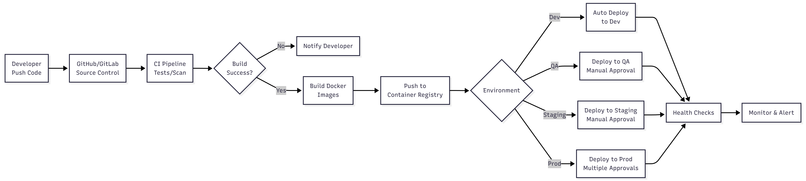

# 7. Consideraciones de Despliegue y Mantenimiento - Conecta360

## Visión General

Este documento describe la estrategia de despliegue, operación y mantenimiento a largo plazo del sistema Conecta360, asegurando alta disponibilidad, escalabilidad continua y evolución del sistema.

## Estrategia de Despliegue

### Ambientes

#### 1. Desarrollo (Development)
**Propósito:** Desarrollo activo y pruebas unitarias

**Configuración:**
- Kubernetes namespace: `dev`
- Infraestructura mínima (1-2 nodos)
- Base de datos: Single instance PostgreSQL
- Kafka: Single broker (o Kafka local)
- Sin replicación (para reducir costos)
- Auto-scaling deshabilitado

**Características:**
- Deploy automático desde ramas de desarrollo
- Datos de prueba sintéticos
- Logs en consola local
- Sin monitoreo complejo

---

#### 2. Testing/QA (Quality Assurance)
**Propósito:** Pruebas funcionales e integración

**Configuración:**
- Kubernetes namespace: `qa`
- Infraestructura similar a producción (escalada 1:4)
- Base de datos: Primary + 1 Read Replica
- Kafka: Cluster de 3 brokers
- Replicación habilitada

**Características:**
- Deploy automático desde rama `qa` o `testing`
- Datos de prueba más realistas
- Monitoreo básico (Prometheus, Grafana)
- Pruebas de carga periódicas

---

#### 3. Staging/Pre-Producción
**Propósito:** Pruebas finales antes de producción, capacitación

**Configuración:**
- Kubernetes namespace: `staging`
- Infraestructura idéntica a producción (escalada 1:2)
- Base de datos: Primary + Read Replicas (multi-región)
- Kafka: Cluster completo con replicación
- Todas las integraciones reales (con limites)

**Características:**
- Deploy desde rama `staging` o releases candidates
- Datos anonimizados de producción
- Monitoreo completo (mismo que producción)
- Pruebas de desastre recovery

---

#### 4. Producción (Production)
**Propósito:** Sistema en operación real

**Configuración:**
- Kubernetes namespace: `prod`
- Multi-región: Región A (principal) + Región B (DR)
- Base de datos: Primary + múltiples Read Replicas por región
- Kafka: Cluster de 3 brokers por región con replicación cross-region
- CDN global para assets estáticos
- Auto-scaling completo

**Características:**
- Deploy controlado desde rama `main` con aprobaciones
- Datos reales de ciudadanos
- Monitoreo completo y alertas 24/7
- Backup y disaster recovery activos
- SSL/TLS end-to-end

---

### Pipeline CI/CD


#### Etapas del Pipeline

**1. Source Control**
- Git flow: `main`, `develop`, `feature/*`, `hotfix/*`
- Branch protection: Requiere PR reviews y CI checks
- Commit hooks: Linting, format checks

**2. Continuous Integration (CI)**
```yaml
# Ejemplo .github/workflows/ci.yml
name: CI Pipeline
on:
  pull_request:
  push:
    branches: [main, develop]

jobs:
  test:
    runs-on: ubuntu-latest
    steps:
      - uses: actions/checkout@v3
      - name: Run unit tests
        run: npm test
      - name: Run integration tests
        run: npm run test:integration
      - name: Security scanning
        run: npm audit && snyk test
  
  build:
    needs: test
    runs-on: ubuntu-latest
    steps:
      - name: Build Docker image
        run: docker build -t conecta360/service:${{ github.sha }} .
      - name: Push to registry
        run: docker push conecta360/service:${{ github.sha }}
  
  deploy-dev:
    needs: build
    if: github.ref == 'refs/heads/develop'
    runs-on: ubuntu-latest
    steps:
      - name: Deploy to Dev
        run: kubectl set image deployment/service service=conecta360/service:${{ github.sha }} -n dev
```

**3. Continuous Deployment (CD)**
- **Dev**: Auto-deploy en cada push a `develop`
- **QA**: Auto-deploy con aprobación de QA lead
- **Staging**: Deploy manual con aprobación de tech lead
- **Production**: Blue-Green o Canary deployment con múltiples aprobaciones

---

### Estrategias de Despliegue

#### 1. Blue-Green Deployment
**Descripción:** Mantener dos ambientes idénticos (Blue y Green), cambiar tráfico instantáneamente

**Ventajas:**
- Rollback instantáneo
- Sin downtime
- Pruebas en ambiente idéntico antes de switch

**Uso:** Producción para releases mayores

**Implementación:**
```yaml
# Kubernetes Service con selectores intercambiables
apiVersion: v1
kind: Service
metadata:
  name: casos-service
spec:
  selector:
    version: blue  # Cambiar a 'green' para nuevo deploy
  ports:
    - port: 80
```

**Proceso:**
1. Desplegar nueva versión en ambiente Green (paralelo a Blue)
2. Ejecutar smoke tests en Green
3. Cambiar selector de Service a Green
4. Monitorear métricas
5. Si hay problemas, revertir a Blue (instantáneo)
6. Si todo OK, mantener Green y preparar próximo Blue

---

#### 2. Canary Deployment
**Descripción:** Desplegar nueva versión a un pequeño porcentaje de tráfico, incrementar gradualmente

**Ventajas:**
- Detección temprana de problemas
- Rollback fácil
- Menor impacto si hay issues

**Uso:** Producción para releases menores o actualizaciones frecuentes

**Implementación:**
```yaml
# Istio VirtualService para canary
apiVersion: networking.istio.io/v1alpha3
kind: VirtualService
metadata:
  name: casos-vs
spec:
  hosts:
    - casos.conecta360.gov.cv
  http:
    - match:
        - headers:
            canary:
              exact: "true"
      route:
        - destination:
            host: casos-service
            subset: canary
      weight: 10  # 10% tráfico
    - route:
        - destination:
            host: casos-service
            subset: stable
      weight: 90  # 90% tráfico
```

**Proceso:**
1. Desplegar canary (10% tráfico)
2. Monitorear métricas por 30 minutos
3. Si OK, incrementar a 25%, luego 50%, luego 100%
4. Si hay problemas, reducir a 0% (rollback)

---

#### 3. Rolling Update (Default Kubernetes)
**Descripción:** Actualizar pods gradualmente, reemplazando uno por uno

**Ventajas:**
- Simple, automático
- Sin downtime si hay múltiples réplicas

**Uso:** Desarrollo, QA, releases menores

**Configuración:**
```yaml
apiVersion: apps/v1
kind: Deployment
metadata:
  name: casos-deployment
spec:
  replicas: 5
  strategy:
    type: RollingUpdate
    rollingUpdate:
      maxSurge: 1        # Pods adicionales durante update
      maxUnavailable: 1  # Pods que pueden estar down
  template:
    spec:
      containers:
      - name: casos
        image: conecta360/casos:v1.2.0
```

---

### Configuración de Infraestructura como Código (IaC)

#### Terraform para Infraestructura Cloud

```hcl
# Ejemplo: main.tf
provider "aws" {
  region = "us-east-1"
}

module "eks_cluster" {
  source = "./modules/eks"
  
  cluster_name    = "conecta360-prod"
  node_group_size = "t3.large"
  min_nodes       = 3
  max_nodes       = 10
  desired_nodes   = 5
}

module "rds_postgres" {
  source = "./modules/rds"
  
  instance_class      = "db.r5.xlarge"
  allocated_storage   = 500
  multi_az            = true
  backup_retention    = 30
  deletion_protection = true
}

module "kafka_msk" {
  source = "./modules/msk"
  
  cluster_name        = "conecta360-kafka"
  instance_type       = "kafka.m5.large"
  broker_count        = 3
  replication_factor  = 3
}
```

#### Helm Charts para Kubernetes

```yaml
# valores-prod.yaml
replicaCount: 5

image:
  repository: conecta360/casos
  tag: "v1.2.0"
  pullPolicy: Always

resources:
  requests:
    cpu: 500m
    memory: 1Gi
  limits:
    cpu: 2000m
    memory: 4Gi

autoscaling:
  enabled: true
  minReplicas: 5
  maxReplicas: 20
  targetCPUUtilizationPercentage: 70
  targetMemoryUtilizationPercentage: 80

env:
  - name: DB_HOST
    valueFrom:
      secretKeyRef:
        name: db-credentials
        key: host
  - name: KAFKA_BROKERS
    value: "kafka-1:9092,kafka-2:9092,kafka-3:9092"
```

---

## Operación y Mantenimiento

### Monitoreo y Observabilidad

#### Stack de Monitoreo

**1. Métricas (Prometheus + Grafana)**
- **Recolección**: Prometheus scraping cada 15s
- **Visualización**: Grafana dashboards
- **Retención**: 30 días de métricas

**Métricas Críticas:**
- Request rate (req/s)
- Response time (P50, P95, P99)
- Error rate (%)
- CPU/Memoria por servicio
- Database connections
- Kafka lag
- SLA compliance rate

**Dashboards:**
- Dashboard Global: Visión general del sistema
- Dashboard por Servicio: Métricas detalladas por microservicio
- Dashboard de Infraestructura: CPU, memoria, red, disk
- Dashboard de Negocio: Casos por estado, tiempos de resolución, SLA

---

**2. Logging (ELK Stack)**
- **Recolección**: Filebeat en cada pod → Logstash → Elasticsearch
- **Visualización**: Kibana
- **Retención**: 90 días de logs

**Logs Estructurados:**
```json
{
  "timestamp": "2024-01-15T10:30:00Z",
  "level": "INFO",
  "service": "microservicio-casos",
  "trace_id": "abc123",
  "span_id": "def456",
  "message": "Caso creado exitosamente",
  "caso_id": 12345,
  "numero_caso": "CRV-2024-00012345",
  "usuario_id": 5432,
  "request_id": "req_xyz789"
}
```

**Búsqueda en Kibana:**
- Búsqueda por trace_id para seguir requests
- Búsqueda por caso_id para auditoría
- Alertas basadas en patrones de logs (errores, excepciones)

---

**3. Distributed Tracing (Jaeger/Zipkin)**
- **Propósito**: Seguir requests a través de múltiples servicios
- **Sampling**: 100% en producción (o adaptativo según carga)

**Información Capturada:**
- Tiempo de cada operación
- Servicios involucrados
- Llamadas HTTP/gRPC entre servicios
- Queries a base de datos
- Llamadas a Kafka

---

#### Alertas y Notificaciones

**Niveles de Severidad:**

**Critical (Pager Duty - On-call 24/7)**
- Servicios down
- Database down
- Kafka cluster down
- Error rate > 10%
- SLA violation masivo
- Security breach

**High (Email + Slack)**
- Error rate > 5%
- Response time P95 > 3s
- Database connection pool exhaustion
- Kafka lag > 1000 mensajes
- Disk space > 80%

**Medium (Slack)**
- CPU > 80% por más de 10 minutos
- Memory > 80% por más de 10 minutos
- Warnings en logs

**Low (Slack channel de info)**
- Deployments exitosos
- Health checks OK después de fallos

**Ejemplo de Alerta (Prometheus + Alertmanager):**
```yaml
groups:
  - name: conecta360_alerts
    rules:
      - alert: HighErrorRate
        expr: rate(http_requests_total{status=~"5.."}[5m]) > 0.05
        for: 5m
        labels:
          severity: high
        annotations:
          summary: "Error rate above 5%"
          description: "Service {{ $labels.service }} has error rate of {{ $value }}"
      
      - alert: DatabaseDown
        expr: up{job="postgres"} == 0
        for: 1m
        labels:
          severity: critical
        annotations:
          summary: "PostgreSQL database is down"
```

---

### Mantenimiento Preventivo

#### 1. Actualizaciones y Parches

**Política de Actualizaciones:**
- **Security patches**: Aplicar dentro de 48 horas
- **Minor updates**: Mensual (ventana de mantenimiento)
- **Major updates**: Trimestral con plan detallado

**Proceso:**
1. **Evaluación**: Revisar changelog y breaking changes
2. **Testing**: Probar en QA/Staging por 1 semana
3. **Planificación**: Ventana de mantenimiento comunicada
4. **Ejecución**: Blue-Green deployment en producción
5. **Validación**: Smoke tests post-deployment
6. **Monitoreo**: 24 horas de monitoreo intensivo

---

#### 2. Backup y Restauración

**Estrategia de Backups:**

**Base de Datos (PostgreSQL):**
- **Incrementales**: Cada 6 horas (retención 7 días)
- **Completos diarios**: A las 2:00 AM (retención 30 días)
- **Completos semanales**: Domingos (retención 90 días)
- **Backup antes de deployments**: Automático

**Backup de Configuraciones:**
- Kubernetes configs: Git (versionado)
- Secrets: HashiCorp Vault o AWS Secrets Manager
- Terraform state: S3 con versionado

**Testing de Restauración:**
- **Mensual**: Restaurar backup de staging en ambiente aislado
- **Trimestral**: Disaster recovery drill completo
- **Documentación**: Procedimientos documentados y actualizados

**RTO/RPO Objetivos:**
- **RTO (Recovery Time Objective)**: < 1 hora
- **RPO (Recovery Point Objective)**: < 15 minutos

---

#### 3. Limpieza y Archivado

**Datos Antiguos:**
- **Casos cerrados > 2 años**: Archivados a S3 Glacier
- **Logs > 90 días**: Compressed y movidos a S3
- **Eventos Kafka > 30 días**: Compactados o eliminados
- **Auditoría**: Retención según normativa (7 años recomendado)

**Proceso Automatizado:**
```python
# Ejemplo: Script de archivado mensual
def archivar_casos_antiguos():
    fecha_limite = datetime.now() - timedelta(days=730)
    casos = obtener_casos_cerrados_anteriores_a(fecha_limite)
    
    for caso in casos:
        # Exportar a formato comprimido
        datos = exportar_caso_completo(caso)
        # Subir a S3 Glacier
        s3.upload_to_glacier(f"archivos/{caso.numero_caso}.tar.gz", datos)
        # Eliminar de base de datos principal
        eliminar_caso(caso.id)
        # Registrar en índice de archivos
        registrar_archivo(caso.numero_caso, "s3://glacier/...")
```

---

#### 4. Performance Tuning Continuo

**Análisis Regular:**
- **Semanal**: Revisión de queries lentas en PostgreSQL
- **Mensual**: Análisis de uso de índices
- **Trimestral**: Optimización de microservicios (profiling)

**Herramientas:**
- PostgreSQL `pg_stat_statements` para queries lentas
- APM tools (New Relic, Datadog, o similar)
- Profiling de código (Java Flight Recorder, Node.js clinic.js)

**Optimizaciones Comunes:**
- Agregar índices faltantes
- Optimizar queries N+1
- Ajustar connection pools
- Tuning de JVM (heap size, GC)
- Cache misses analysis

---

#### 5. Seguridad Continuada

**Auditorías de Seguridad:**
- **Mensual**: Vulnerability scanning (dependencias)
- **Trimestral**: Penetration testing externo
- **Anual**: Security audit completo

**Actividades Regulares:**
- Rotación de secrets (cada 90 días)
- Revisión de permisos RBAC (trimestral)
- Análisis de logs de seguridad (SIEM)
- Actualización de certificados SSL/TLS

**Compliance:**
- Revisión de cumplimiento normativo (semestral)
- Actualización de políticas según nuevas normativas
- Reportes de compliance a autoridades

---

### Escalabilidad y Capacity Planning

#### Análisis de Crecimiento

**Métricas a Monitorear:**
- Casos creados por día (tendencia)
- Usuarios activos (crecimiento)
- Tráfico de API (req/s)
- Uso de recursos (CPU, memoria, disk, network)
- Costos de infraestructura

**Proyecciones:**
- **Mensual**: Revisar tendencias y proyectar 3 meses
- **Trimestral**: Proyección anual con ajustes
- **Anual**: Plan de capacidad para siguiente año

**Escalado Proactivo:**
- Auto-scaling para picos de tráfico
- Escalado manual anticipado para eventos conocidos (ej: campañas gubernamentales)
- Provisioning adicional antes de fechas de alta demanda

---

#### Cost Optimization

**Revisión Trimestral:**
1. Análisis de uso de recursos
2. Identificación de instancias subutilizadas
3. Right-sizing recommendations
4. Evaluación de Reserved Instances vs On-Demand
5. Optimización de storage (data tiering)

**Estrategias:**
- **Reserved Instances**: Para workloads estables (1-3 años)
- **Spot Instances**: Para workloads tolerantes a fallos
- **Auto-scaling**: Reducir instancias en horas de bajo uso
- **Data tiering**: Datos antiguos a storage económico
- **Cache optimization**: Reducir carga en servicios pagados

---

### Gestión de Incidencias

#### Runbooks (Procedimientos Operativos)

**Ejemplo: Runbook para "Caso no se asigna automáticamente"**

1. **Síntoma**: Casos quedan en estado PENDIENTE por > 10 minutos
2. **Diagnóstico**:
   ```bash
   # Verificar servicio de derivación
   kubectl logs -n prod deployment/microservicio-derivacion --tail=100
   
   # Verificar Kafka consumers
   kafka-consumer-groups.sh --bootstrap-server kafka:9092 \
     --group derivacion-group --describe
   
   # Verificar reglas de derivación en DB
   psql -c "SELECT * FROM reglas_derivacion WHERE activa = true;"
   ```
3. **Acciones**:
   - Si servicio down: `kubectl rollout restart deployment/microservicio-derivacion`
   - Si Kafka lag: Escalar consumers o reiniciar servicio
   - Si reglas incorrectas: Revisar y corregir configuración
4. **Verificación**: Crear caso de prueba y verificar asignación
5. **Escalación**: Si problema persiste > 15 min, escalar a on-call

**Runbooks Disponibles:**
- Database connection pool exhaustion
- Kafka broker down
- High error rate en microservicio
- SSL certificate expiration
- Disk space full
- Service memory leak

---

#### On-Call Rotation

**Estructura:**
- **Primary on-call**: Disponible 24/7, responde en < 15 minutos
- **Secondary on-call**: Backup si primary no responde
- **Rotación**: Semanal (lunes a lunes)

**Herramientas:**
- PagerDuty o OpsGenie para alertas
- Escalación automática si no hay respuesta
- Runbooks accesibles desde móvil

---

### Documentación Operativa

#### Documentación Requerida

**1. Arquitectura**
- Diagramas actualizados
- Descripción de componentes
- Flujos de datos
- Integraciones externas

**2. Procedimientos**
- Deployment procedures
- Rollback procedures
- Backup/restore procedures
- Disaster recovery plan

**3. Troubleshooting**
- Runbooks para incidencias comunes
- Known issues y workarounds
- Contactos de soporte (proveedores externos)

**4. Cambios**
- Changelog de releases
- Breaking changes documentados
- Migration guides

---

## Plan de Mantenimiento a Largo Plazo

### Evolución del Sistema

#### Roadmap Técnico (3-5 años)

**Año 1: Estabilización**
- Optimización de performance
- Refinamiento de procesos operativos
- Expansión de integraciones
- Mejora de UX basada en feedback

**Año 2: Mejoras Avanzadas**
- Machine Learning para routing inteligente
- Chatbot más sofisticado (GPT-based)
- Mobile app nativa optimizada
- Integración con más canales (WhatsApp, Telegram)

**Año 3-5: Innovación**
- Predictive analytics (predecir demandas)
- IoT integration (sensores ciudadanos)
- Blockchain para trazabilidad inmutable (si es requerido)
- AI avanzada para resolución automática de casos simples

---

### Actualizaciones Tecnológicas

**Ciclo de Vida de Tecnologías:**
- **LTS (Long Term Support)**: Preferir versiones LTS
- **Deprecation timeline**: Planificar migraciones con 12-18 meses de anticipación
- **Security EOL**: Actualizar antes de End of Life

**Estrategia de Actualización:**
- Evaluar nuevas tecnologías anualmente
- Prototipos en ambientes no productivos
- Migraciones graduales cuando sea posible
- Documentar decisiones de no actualizar (cuando aplique)

---

### Sostenibilidad

#### Técnica
- **Code quality**: Code reviews, testing coverage > 80%
- **Documentación**: Mantenida y actualizada
- **Debt management**: Identificar y priorizar technical debt
- **Refactoring**: Refactoring continuo para mantener código limpio

#### Organizacional
- **Knowledge sharing**: Sessions regulares de conocimiento
- **Training**: Capacitación continua del equipo
- **Documentation**: Conocimiento documentado, no solo en personas
- **Succession planning**: No depender de una sola persona

#### Financiera
- **Cost monitoring**: Monitoreo continuo de costos
- **ROI analysis**: Medir retorno de inversión
- **Budget planning**: Planificación anual de presupuesto
- **Optimization**: Optimización continua de costos

---

## Conclusión

El sistema Conecta360 está diseñado para ser **operable, mantenible y evolutivo** a largo plazo. Las estrategias de despliegue, monitoreo, mantenimiento y evolución descritas aseguran que el sistema pueda:

1. **Operar confiablemente** 24/7 con alta disponibilidad
2. **Escalar** según demanda creciente
3. **Mantenerse** de forma eficiente y económica
4. **Evolucionar** con nuevas tecnologías y requerimientos

La clave está en **automatización**, **monitoreo proactivo**, **documentación actualizada** y **mejora continua**.

---

**Fin de la Documentación Arquitectónica**

